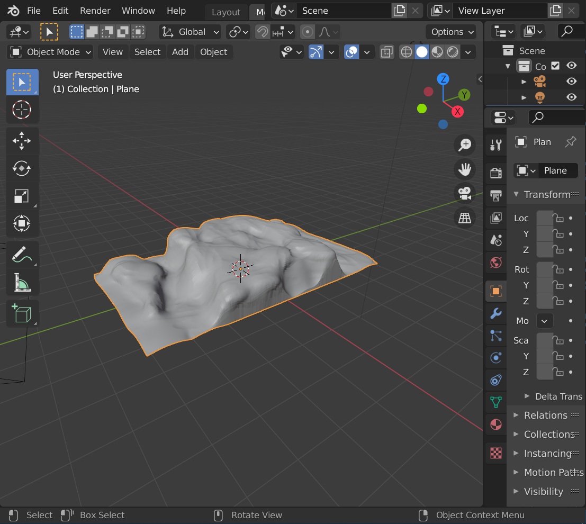

# Height map data visualization using LCJS

Simple proof of concept / playground for visualizing a height map.

The height data was generated using a novel method for scanning a 3D geometry file with a `Node.js` script (`scan-heightmap.js`).

The 3D geometry was drawn with `Blender` (open source 3D modeling software):

The goal was to simulate a sonar data visualization application, where Y coordinate represents the horizontal plane around the boat and color represents depth.

The entire chart application is created with a single static `HTML` file, no installation or build required.

The application is hosted using GitHub Pages and can be viewed [here](https://nipatsku.github.io/heightmap-data-viz/)
